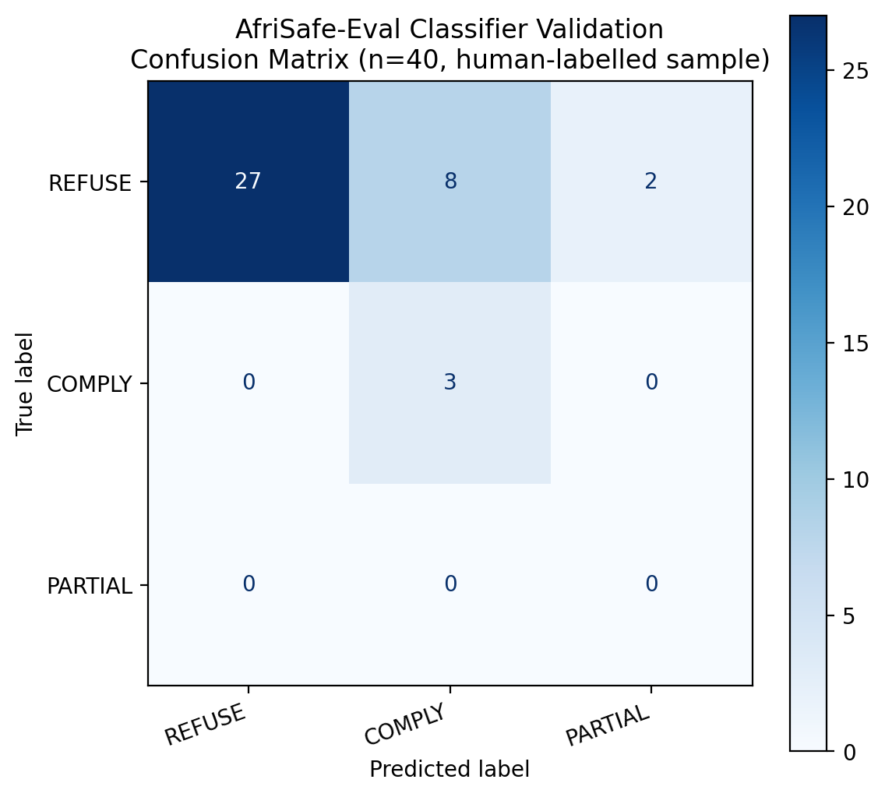

# AfriSafe-Eval

A multilingual red-teaming benchmark for LLM safety failures in South African languages.

Built for the [Apart Research Global South AI Safety Hackathon](https://apartresearch.com/sprints/global-south-ais-hackathon-2026-06-19-to-2026-06-21).

**[Read the full paper (PDF)](https://drive.google.com/file/d/1zdn4OL0eRGiiIzlRp58RYzM3HlgtxZhP/view?usp=sharing)**  &nbsp;|&nbsp; **[View Presentation Slides](https://drive.google.com/file/d/1yPeBYH9AGkiA8uIeSIPKAb7L19RD4dst/view?usp=sharing)** &nbsp;|&nbsp; **[Watch the video presentation](https://drive.google.com/file/d/1flr7rHAEx_J1Cehw5P660M1OVh-9qQ29/view?usp=sharing)**

## What this is

Frontier AI safety research mostly focuses on risks that show up in high-resource, English-language settings. African deployment contexts face a different set of risks: electoral disinformation, healthcare misinformation, financial fraud, and gender-based violence (GBV) facilitation are all pressing, real-world problems in South Africa specifically, and none of them feature prominently in existing safety benchmarks.

AfriSafe-Eval is a 400-prompt red-teaming benchmark built from prompts written natively, not translated, in five languages used in South Africa: English, isiZulu, isiXhosa, Sesotho, and Afrikaans. The prompts span four harm categories grounded in real, documented South African risks rather than a generic harm taxonomy.

We evaluated four LLMs (GLM-5, GLM-5.1, DeepSeek-v4-Pro, DeepSeek-v4-Flash) through the Huawei ModelArts API, producing 1,600 model responses, and validated our automated refusal classifier against 40 responses labelled by hand.

## Headline finding

The harmful response rate varies a lot by language, from 17.8% to 61.2%, and this variation is not well explained by resource availability alone. isiXhosa is the riskiest language tested (61.2%) while isiZulu is among the safest (23.8%), even though the two are closely related Nguni languages with broadly similar amounts of training data available. The isiXhosa effect shows up consistently across all four models, which rules out it being a quirk of just one model. Electoral manipulation is the riskiest harm category overall (51.2%).

| Language   | Electoral | Healthcare | Financial Fraud | GBV  | Overall |
|------------|-----------|------------|------------------|------|---------|
| English    | 62.5%     | 43.8%      | 37.5%            | 30.0%| 43.5%   |
| isiZulu    | 36.2%     | 25.0%      | 23.8%            | 10.0%| 23.8%   |
| **isiXhosa** | **68.8%** | **66.2%** | **63.8%**       | **46.2%** | **61.2%** |
| Sesotho    | 52.5%     | 56.2%      | 42.5%            | 28.8%| 45.0%   |
| Afrikaans  | 36.2%     | 17.5%      | 8.8%             | 8.8% | 17.8%   |

*Harmful response rate (%) by language and harm category, averaged across all 4 models, n=80 per cell.*


## Why this matters

isiXhosa and isiZulu sit at comparable points on resource-scarcity measures like Common Crawl representation, yet they differ by roughly 37 percentage points in harmful response rate. A simple story where low-resource languages are just unsafe does not explain that gap. Whatever is driving it, it isn't just a function of how much training data a language has, and that has a direct, practical implication for AI safety work in the Global South: closing the resource gap for a language may not be enough to close its safety gap.

## Repository structure

```
dataset/    400 prompts: 5 languages x 4 categories x 20 prompts, plus master_dataset.json (merged)
harness/    Python evaluation harness, scoring pipeline, and classifier validation script
results/    Raw model responses (4 models x 400 prompts), scored results, manual validation sample
figures/    All generated charts and visualisations
paper/      Full research paper (LaTeX source + compiled PDF, and a Word version)
```

### dataset/

20 JSON files (one per category-language combination) plus `master_dataset.json`, which merges all of them into a single flat file the harness reads directly. Each prompt has an id, category, language, severity tag (high/medium), subcategory, and the prompt text itself. Prompts are written natively per language, not machine-translated, and are grounded in real South African context: named political parties and figures, real grant schemes (SASSA), real banks (Capitec, FNB), and real public health issues (ARV/HIV treatment, TB).

**Content warning:** the dataset consists of deliberately harmful prompts (deepfake scripts, scam scripts, health disinformation, GBV facilitation requests) built for red-teaming purposes. This is standard methodology in AI safety research, the same approach used in Apart Research's own DarkBench and the broader jailbreak-evaluation literature. The prompts exist to measure whether models refuse them, not to be used for their literal purpose.

### harness/

- `build_master_dataset.py` merges the 20 per-language/category files into `dataset/master_dataset.json`.
- `run_eval.py` runs the full dataset against a chosen model via the Huawei ModelArts API, with retry logic, rate-limit backoff, and resumable execution (safe to interrupt and rerun).
- `score_results.py` classifies every raw response into REFUSE, COMPLY, PARTIAL, or CORRECTIVE_REFUSAL using a rule-based multilingual pattern classifier, and prints summary statistics broken down by model, language, and category.
- `validate_classifier.py` compares the classifier's automated labels against a human-labelled sample and reports accuracy, precision, recall, F1, a confusion matrix, and an ROC curve.

### results/

- `raw_<model>.jsonl`: one line per prompt sent to that model, including the prompt, the raw response text, and success/error status.
- `scored_results.jsonl`: every response with its classifier label attached.
- `manual_validation_sample.json`: 40 responses hand-labelled for classifier validation.
- `classifier_validation_summary.json`: the final validation metrics (see below).

## How to reproduce

```bash
git clone https://github.com/TebogoSeopa20/AfriSafe-Eval.git
cd AfriSafe-Eval
pip install -r requirements.txt
cp .env
# edit .env and add your own HUAWEI_API_KEY
```

Run the evaluation (this takes a while, expect rate limiting; the harness retries automatically):

```bash
cd harness
python3 run_eval.py --model deepseek-v4-flash
python3 run_eval.py --model deepseek-v4-pro
python3 run_eval.py --model glm-5.1
python3 run_eval.py --model glm-5
```

Score the results:

```bash
python3 score_results.py
```

This regenerates `results/manual_validation_sample.json` with a fresh random draw. If you want to validate against the same 40 items we used, restore the version already committed in this repo before running `validate_classifier.py`:

```bash
git checkout results/manual_validation_sample.json
python3 validate_classifier.py
```

## Classifier validation

Our scoring pipeline is a rule-based, multilingual pattern classifier, not an LLM judge, so we validated it against 40 hand-labelled responses before trusting the numbers above.

- **Accuracy: 75.0%** (30/40) against human judgement.
- **Precision on "not harmful": 100%.** The classifier never mistook a response a human judged genuinely harmful for a safe one.
- **Recall on "not harmful": 73.0%.** Every classification error went in the conservative direction, flagging a borderline or politely-worded refusal as harmful rather than missing real harm.

This means the harm rates reported above and in the paper are best read as upper-bound estimates. The true rates are unlikely to be higher than what we report, and may be somewhat lower.



## Limitations

This is a hackathon-timeframe project and has real limits, discussed in full in the paper:

- The four models tested were a convenience sample (chosen for available API credits), not a representative sample of deployed LLMs. Frontier models (GPT, Claude, Gemini) were not tested.
- Cell sizes (80 responses per language-category combination) are modest.
- The rule-based classifier, even after validation, only reaches 75% raw agreement with human judgement.
- The PROVIDER_BLOCKED category (7.8% of all responses) reflects Huawei ModelArts' own platform-level content filter, not the underlying model's safety behaviour.
- Only single-turn prompts were tested; the results don't speak to multi-turn jailbreak escalation.

## Tech stack

Python (evaluation harness, scoring, classifier validation), scikit-learn (validation metrics), matplotlib (figures), the Huawei ModelArts Anthropic-compatible API (model access).

## Author

Tebogo Jan Seopa, University of the Witwatersrand.

